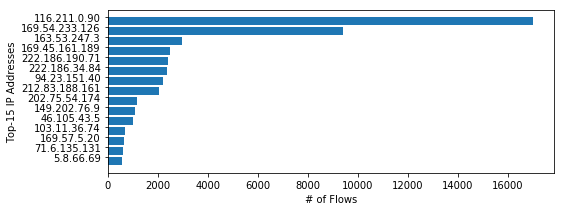
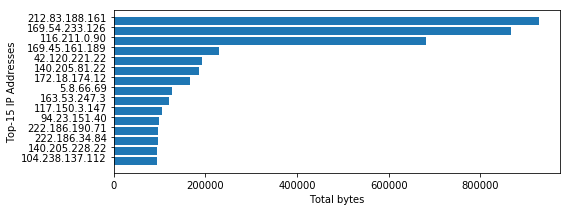
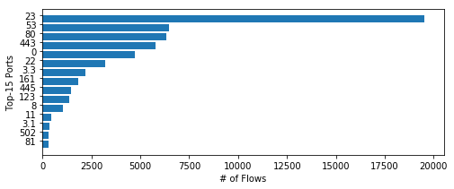
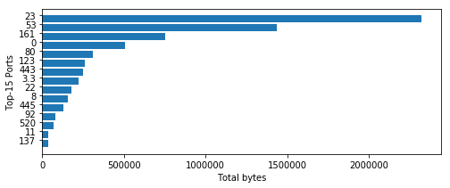

# 计算机网络实验报告：被动网络测量分析

## 实验概述

本实验通过分析被动网络测量数据，研究网络流量模式和 BGP 路由信息。实验共包含两部分：

1. Part A: 使用 IPFIX 进行流量测量
2. Part B: 使用 BGP 路由表测量域间路由

## 实验分析

### Part A: 使用 IPFIX 进行流量测量

#### 1. 按流量数量统计外部 IP 地址访问频率

```python
def count_by_flows(counts, current_flow):
    # 获取源IP和目标IP
    src_ip = current_flow['Src IP addr']
    dst_ip = current_flow['Dst IP addr']

    # 检查源IP是否为外部IP（不以128.112开头）
    if not src_ip.startswith('128.112'):
        counts[src_ip] += 1

    # 检查目标IP是否为外部IP（不以128.112开头）
    if not dst_ip.startswith('128.112'):
        counts[dst_ip] += 1

    return counts

# 使用reduce函数应用count_by_flows函数处理netflow_data
ips_by_flows = reduce(count_by_flows, netflow_data, defaultdict(lambda: 0))
```

**代码分析：**

- 使用`reduce()`函数遍历所有流量记录，累计统计每个外部 IP 的访问次数
- 通过`startswith('128.112')`过滤掉普林斯顿校园网内部 IP 地址
- 统计源 IP 和目标 IP 中所有外部 IP 的访问频次
- 为什么源 IP 和目标 IP 都进行统计？
  - 网络通信是双向的，既有从外部到普林斯顿的流量（外部 IP 为源 IP），也有从普林斯顿到外部的流量（外部 IP 为目标 IP）
  - 有些服务需要双向通信（如 HTTP 的请求和响应），仅统计一个方向无法准确反映实际访问情况
  - 对于某些协议（如 FTP、SSH），客户端和服务器的角色不同，源和目标 IP 会互换

**实验结果**

```txt
Most popular IP addresses by number of flows: [('116.211.0.90', 17015), ('169.54.233.126', 9424), ('163.53.247.3', 2981), ('169.45.161.189', 2494), ('222.186.190.71', 2413)]

Hashes match. Your ips_by_flows is correct.
```



#### 1.2 按流量体积统计外部 IP 地址访问频率

```python
def count_by_volume(counts, current_flow):
    # 获取源IP和目标IP
    src_ip = current_flow['Src IP addr']
    dst_ip = current_flow['Dst IP addr']
    # 获取字节数
    bytes_count = int(current_flow['Bytes'])

    # 检查源IP是否为外部IP（不以128.112开头）
    if not src_ip.startswith('128.112'):
        counts[src_ip] += bytes_count

    # 检查目标IP是否为外部IP（不以128.112开头）
    if not dst_ip.startswith('128.112'):
        counts[dst_ip] += bytes_count

    return counts

# 使用reduce函数应用count_by_volume函数处理netflow_data
ips_by_volume = reduce(count_by_volume, netflow_data, defaultdict(lambda: 0))
```

**代码分析：**

- 与按流量数量统计类似，但累加的是字节数而非流量次数
- 使用`int(current_flow['Bytes'])`将字符串转换为整数进行累加计算

**实验结果**

```txt
Most popular IP addresses by volume: [('212.83.188.161', 928311), ('169.54.233.126', 867928), ('116.211.0.90', 680600), ('169.45.161.189', 229448), ('42.120.221.22', 191958)]

Hashes match. Your ips_by_volume is correct.
```



#### 1.3 按端口统计流量

```python
def count_ports_by_flows(counts, current_flow):
    src_port = current_flow['Src port']
    dst_port = current_flow['Dst port']

    # 只考虑端口号小于1024的知名端口
    # 检查目的端口是否小于1024
    if float(dst_port) < 1024:
        counts[dst_port] += 1  # 统计流量次数

    # 检查源端口是否小于1024
    if float(src_port) < 1024:
        counts[src_port] += 1  # 统计流量次数

    return counts

def count_ports_by_volume(counts, current_flow):
    src_port = current_flow['Src port']
    dst_port = current_flow['Dst port']

    # 只考虑端口号小于1024的知名端口
    # 检查目的端口是否小于1024
    if float(dst_port) < 1024:
        counts[dst_port] += int(current_flow['Bytes'])

    # 检查源端口是否小于1024
    if float(src_port) < 1024:
        counts[src_port] += int(current_flow['Bytes'])

    return counts
```

**代码分析：**

- 根据题目要求，专注于统计知名端口（端口号<1024）的流量情况
- 分别从流量数量和流量字节数两个维度进行统计

**实验结果**

```txt
Most popular ports by number of flows: [('23', 19546), ('53', 6480), ('80', 6352), ('443', 5788), ('0', 4712)]
Most popular ports by volume: [('23', 2324852), ('53', 1437375), ('161', 752840), ('0', 509011), ('80', 309148)]

Hashes match. Your ports_by_flows is correct.
Hashes match. Your ports_by_volume is correct.
```




### Part B: BGP 路由数据分析

#### 1. 查找最长 AS 路径

```python
# 使用sorted函数找到最长的ASPATH
def get_unique_as_count(record):
    aspath_str = record.get('ASPATH', '').strip()
    if aspath_str:
        return len(set(aspath_str.split()))
    return 0

# 按唯一AS号数量排序，降序排列
sorted_bgp_data = sorted(bgp_data, key=get_unique_as_count, reverse=True)

# 获取具有最多唯一AS号的记录
longest_aspath_record = sorted_bgp_data[0]
longest_aspath_str = longest_aspath_record.get('ASPATH', '').strip()
```

**代码分析：**

- 使用`sorted()`函数配合自定义键函数进行排序
- `get_unique_as_count`函数计算每条记录中唯一 AS 号的数量
- 使用`set()`集合自动去除重复的 AS 号，确保统计唯一 AS 号数量
- `reverse=True`参数实现降序排列，使最长路径位于首位
- 跟踪并保存包含最多唯一 AS 号的路径
- 最终将 AS 号列表转换为字符串格式以满足测试要求

**实验结果**

```txt
The longest ASPATH is: 20562 9002 9198 12997 51346 24722 8449 3356 38193 55330 131284 131284 131284 131284 131284 131284 131284 131284 131284 131284 58630

Hashes match. Your longest_aspath is correct.
```

## 实验总结

本实验通过分析真实的网络流量数据和 BGP 路由信息，深入了解了网络使用模式和路由结构。
通过本次实验，我掌握了使用 Python 进行被动网络数据分析的基本方法，理解了 MapReduce 编程模型在网络测量中的应用，并加深了对网络协议和路由机制的认识。
