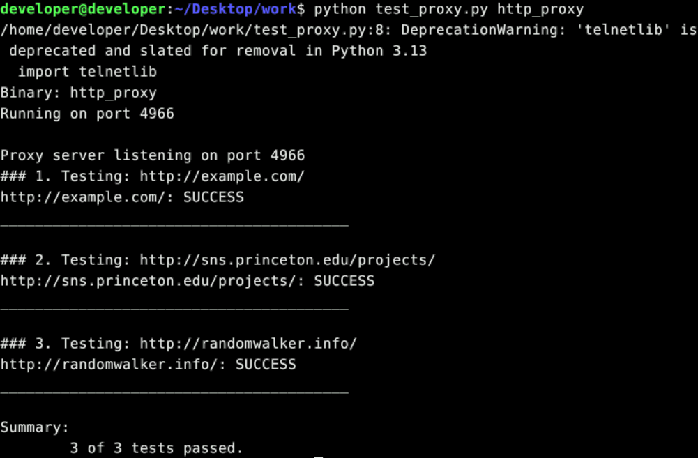
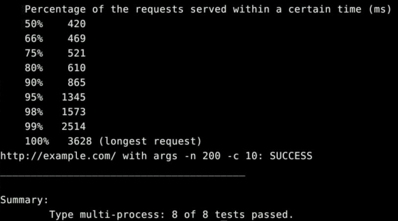
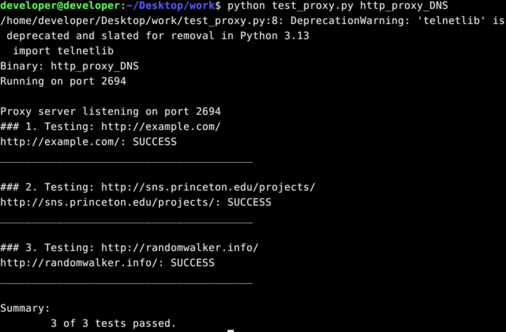
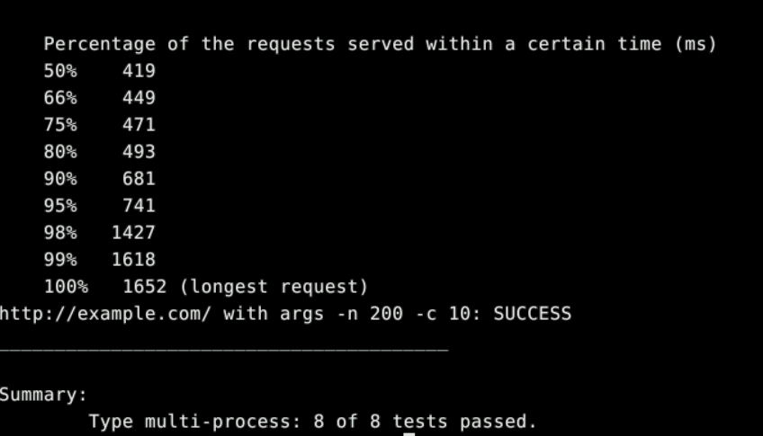

# Assignment 4: HTTP 代理 实验报告

## 实验目的

本次实验的目标是实现一个**HTTP 代理服务器**，能够接收来自多个 Web 客户端的请求并将它们转发到相应的 Web 服务器，然后将服务器的响应返回给客户端。通过这个实验，我们可以深入了解 HTTP 协议的工作原理以及代理服务器在网络通信中的作用。

具体来说，实验分为两个部分：

1. 实现基础的 HTTP 代理功能，能够处理并发连接
2. 在基础代理上增加 DNS 预取功能，提升页面加载速度

## 实验原理

### HTTP 协议基础

HTTP（HyperText Transfer Protocol）是 Web 上最常用的协议之一。HTTP 通信采用请求-响应模式：

1. 客户端向服务器发起连接
2. 客户端发送请求消息（包括请求行、头部字段和可选的消息体）
3. 服务器处理请求并返回响应消息（包括状态行、头部字段和响应体）
4. 连接关闭

### HTTP 代理工作原理

HTTP 代理作为客户端和服务器之间的中间实体，其工作流程如下：

1. 客户端向代理发送请求而不是直接向服务器发送
2. 代理解析请求并建立与目标服务器的连接
3. 代理将修改后的请求转发给服务器
4. 代理接收服务器响应并将其转发回客户端

### DNS 预取优化

DNS 预取是一种性能优化技术，代理在接收到 HTML 页面后，会提前解析其中包含的链接域名对应的 IP 地址，这样当用户点击链接时可以节省 DNS 解析时间。

## 关键代码解析

### 基础 HTTP 代理 (http_proxy.go)

#### 主函数和服务器监听

```go
// main 是程序入口点，启动HTTP代理服务器
// 参数:
//   - os.Args[1]: 监听的端口号
func main() {
	if len(os.Args) != 2 {
		fmt.Println("Usage: ./http_proxy <port>")
		os.Exit(1)
	}

	port := os.Args[1]
	listener, err := net.Listen("tcp", ":"+port)
	if err != nil {
		fmt.Printf("Failed to listen on port %s: %v\n", port, err)
		os.Exit(1)
	}
	defer listener.Close()

	fmt.Printf("Proxy server listening on port %s\n", port)

	for {
		clientConn, err := listener.Accept()
		if err != nil {
			fmt.Printf("Failed to accept connection: %v\n", err)
			continue
		}

		// 限制并发连接数
		if atomic.LoadInt32(&currentConnections) >= maxConcurrentConnections {
			sendErrorResponse(clientConn, http.StatusInternalServerError)
			clientConn.Close()
			continue
		}

		go handleClient(clientConn)
	}
}
```

主函数负责监听指定端口并接受客户端连接。使用`net.Listen`创建 TCP 监听器，然后进入无限循环等待客户端连接。为了防止资源耗尽，设置了最大并发连接数限制。每当有新的客户端连接到来时，启动一个新的 goroutine 来处理该连接，实现并发处理。

#### 客户端请求处理

```go
// handleClient 处理单个客户端连接，执行HTTP请求转发
// 参数:
//   - clientConn: 客户端连接对象
func handleClient(clientConn net.Conn) {
	atomic.AddInt32(&currentConnections, 1)
	defer atomic.AddInt32(&currentConnections, -1)
	defer clientConn.Close()

	// 设置读取超时
	clientConn.SetReadDeadline(time.Now().Add(readTimeout))

	// 从客户端连接读取HTTP请求
	reader := bufio.NewReader(clientConn)
	request, err := http.ReadRequest(reader)
	if err != nil {
		sendErrorResponse(clientConn, http.StatusInternalServerError)
		return
	}
	defer request.Body.Close()

	// 只处理GET请求
	if request.Method != "GET" {
		sendErrorResponse(clientConn, http.StatusInternalServerError)
		return
	}
```

`handleClient`函数处理单个客户端连接。首先使用原子操作增加当前连接计数，在函数结束时减少计数并关闭连接。使用`http.ReadRequest`解析客户端发送的 HTTP 请求，并只处理 GET 方法的请求。

#### 目标服务器连接和请求转发

```go
	// 解析目标地址
	host := request.Host
	if host == "" {
		// 如果请求是绝对URI形式 (http://example.com/path)
		if request.URL.Host != "" {
			host = request.URL.Host
		} else {
			sendErrorResponse(clientConn, http.StatusInternalServerError)
			return
		}
	}

	// 确保端口号存在
	if !strings.Contains(host, ":") {
		host += ":80"
	}

	// 连接到目标服务器
	serverConn, err := net.DialTimeout("tcp", host, dialTimeout)
	if err != nil {
		sendErrorResponse(clientConn, http.StatusInternalServerError)
		return
	}
	defer serverConn.Close()

	// 构建发送到后端服务器的请求
	var reqToServer *http.Request

	// 如果请求URL中已包含主机信息（绝对URL形式），则直接使用
	if request.URL.Host != "" {
		reqToServer = request
	} else {
		// 否则构建一个绝对URL请求
		absoluteURL := fmt.Sprintf("http://%s%s", host, request.URL.RequestURI())
		reqToServer, err = http.NewRequest(request.Method, absoluteURL, nil)
		if err != nil {
			sendErrorResponse(clientConn, http.StatusInternalServerError)
			return
		}

		// 手动复制头部（兼容旧版本Go）
		reqToServer.Header = make(http.Header)
		for key, values := range request.Header {
			for _, value := range values {
				reqToServer.Header.Add(key, value)
			}
		}
	}

	// 删除代理相关的头部
	reqToServer.Header.Del("Proxy-Connection")

	// 设置Connection头为close
	reqToServer.Header.Set("Connection", "close")

	// 设置写入超时并发送请求到目标服务器
	serverConn.SetWriteDeadline(time.Now().Add(writeTimeout))
	err = reqToServer.Write(serverConn)
	if err != nil {
		sendErrorResponse(clientConn, http.StatusInternalServerError)
		return
	}
```

这部分代码解析目标服务器地址并建立连接。根据 HTTP 请求的不同格式（相对 URI 或绝对 URI）构建发送给服务器的请求，并确保设置正确的头部信息。

#### 响应转发回客户端

```go
	// 设置读取超时
	serverConn.SetReadDeadline(time.Now().Add(readTimeout))

	// 将服务器响应转发给客户端
	// 使用带缓冲的复制并设置适当的超时
	clientConn.SetWriteDeadline(time.Now().Add(writeTimeout))

	// 创建带缓冲的reader以提高效率
	bufReader := bufio.NewReader(serverConn)
	_, err = io.Copy(clientConn, bufReader)
	if err != nil {
		sendErrorResponse(clientConn, http.StatusInternalServerError)
		return
	}
```

最后，从服务器读取响应并将其完整地转发回客户端。使用`io.Copy`带缓冲的 reader 高效地传输数据，并设置适当的超时机制防止连接长时间挂起。

### DNS 预取版代理的额外处理函数 (http_proxy_DNS.go)

#### HTML 内容处理和 DNS 预取

```go
	// 从服务器读取响应
	resp, err := http.ReadResponse(bufio.NewReader(serverConn), reqToServer)
	if err != nil {
		sendErrorResponse(clientConn, http.StatusInternalServerError)
		return
	}
	defer resp.Body.Close()

	// 检查是否为HTML内容，如果是，则启动DNS预取
	contentType := resp.Header.Get("Content-Type")
	if strings.Contains(contentType, "text/html") {
		// 创建管道用于复制响应内容
		pr, pw := io.Pipe()

		// 在另一个goroutine中进行DNS预取
		go func() {
			defer pw.Close()
			parseAndPrefetchDNS(pr)
		}()

		// 先将响应头写入客户端
		clientConn.SetWriteDeadline(time.Now().Add(writeTimeout))
		resp.Write(clientConn)

		// 创建一个多写入器，同时写入客户端连接和管道
		multiWriter := io.MultiWriter(clientConn, pw)

		// 然后复制响应体到客户端和DNS预取函数
		_, copyErr := io.Copy(multiWriter, resp.Body)
		pw.Close() // 关闭管道写入端

		if copyErr != nil && !isNetClosedError(copyErr) {
			return
		}
	} else {
		// 非HTML内容，直接转发响应
		clientConn.SetWriteDeadline(time.Now().Add(writeTimeout))
		_, err = io.Copy(clientConn, resp.Body)
		if err != nil && !isNetClosedError(err) {
			return
		}
	}
```

这是 DNS 预取版本的关键差异部分。对于 HTML 内容，使用`io.Pipe`创建管道，同时将响应内容发送给客户端和 DNS 预取函数。通过`io.MultiWriter`实现同时写入多个目标。

#### DNS 预取实现

```go
    // parseAndPrefetchDNS 解析HTML并预取DNS
    // 通过解析HTML内容提取链接，并异步执行DNS查询以提高性能
    // 参数:
    //   - reader: 包含HTML内容的读取器
    func parseAndPrefetchDNS(reader io.Reader) {
        doc, err := html.Parse(reader)
        if err != nil {
            return
        }

        // 提取所有链接并进行DNS预取
        links := extractLinks(doc)
        for _, link := range links {
            if strings.HasPrefix(link, "http") {
                // 解析URL以获取主机名
                urlObj, err := url.Parse(link)
                if err != nil {
                    continue
                }

                // 异步执行DNS查找
                if urlObj.Host != "" {
                    go func(host string) {
                        net.LookupHost(host)
                    }(urlObj.Host)
                }
            }
        }
    }
```

`parseAndPrefetchDNS`函数解析 HTML 文档并提取所有链接，对每个 HTTP 链接，创建一个 goroutine 执行异步 DNS 查询。`LookupHost`会将 DNS 记录缓存到本地 DNS 解析器中，从而加速后续访问。

#### 链接提取函数

```go
// extractLinks 从HTML文档中提取所有链接
// 递归遍历HTML节点树，查找所有<a>标签的href属性
// 参数:
//   - n: HTML节点
// 返回值:
//   - 包含所有链接的字符串切片
func extractLinks(n *html.Node) []string {
	var links []string

	// 递归遍历节点
	if n.Type == html.ElementNode && n.Data == "a" {
		for _, attr := range n.Attr {
			if attr.Key == "href" {
				links = append(links, attr.Val)
				break
			}
		}
	}

	// 递归处理子节点
	for c := n.FirstChild; c != nil; c = c.NextSibling {
		links = append(links, extractLinks(c)...)
	}

	return links
}
```

`extractLinks`函数递归遍历 HTML 节点树，提取所有`<a>`标签的`href`属性值，即页面中的链接地址。

## 测试结果与分析

通过测试脚本`test_proxy.py`和`test_proxy_conc.py`对两个版本的代理进行了测试：

1. http_proxy.go

   - test_proxy.py
     - 测试结果：
   - test_proxy_conc.py
     - 测试结果：

2. http_proxy_DNS.go
   - test_proxy.py
     - 测试结果：
   - test_proxy_conc.py
     - 测试结果：

## 遇到的问题

- 我最开始使用的是课程的虚拟机来进行实验，但是很快我便发现课程的虚拟机在执行我的代码时会出现相同代码多次运行结果不同的情况，并且一直都无法完全通过测试。我询问同学发现他们并没有出现类似情况，于是我认为自己的虚拟机的配置可能有一些问题
- 接着我使用了自己的另一个虚拟机，vmware 中的 ubuntu 虚拟机来进行实验，也出现了相同的情况。于是我认为应该是本机的网络配置有一些问题
- 最后我采用了华为的云主机来进行实验，正常运行代码，正确通过测试

## 实验总结

在本次实验，我成功实现了：

1. **基础 HTTP 代理功能**：能够接收客户端请求，转发到目标服务器，并将响应返回给客户端
2. **并发处理能力**：使用 goroutine 实现多客户端并发处理
3. **DNS 预取优化**：在基础代理基础上增加了 DNS 预取功能，提升用户体验

这次实验加深了我们对 HTTP 协议、网络编程和并发处理的理解，也让我们认识到代理服务器在现代网络架构中的重要作用。
