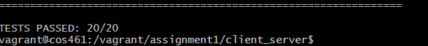

# assignment1 套接字编程 实验报告

## 实验目的

本次实验旨在学习和掌握套接字(Socket)编程的基本原理和技术，实现基于 TCP 协议的客户端-服务器通信程序。通过本实验，我熟悉了网络编程，并实现了在不同编程语言(C 和 Python)下的客户端与服务器通信功能。

## 实验环境

- 操作系统：Ubuntu
- 编程语言：C 语言、Python

## 实验原理

### 套接字(Socket)简介

套接字(Socket)是一种通信机制，允许不同机器间的进程进行通信。它提供了应用层进程利用网络协议栈传递数据的编程接口。

### TCP 通信流程

1. 服务器端：

   - 创建套接字
   - 绑定地址和端口
   - 监听连接请求
   - 接受客户端连接
   - 接收和处理数据
   - 关闭连接

2. 客户端：
   - 创建套接字
   - 连接服务器
   - 发送数据
   - 关闭连接

## 关键代码解析

### C 语言版本实现

#### 服务器端关键逻辑

服务器端的核心在于建立监听套接字并循环处理客户端连接。首先创建一个 socket 并设置 SO_REUSEADDR 选项以允许地址重用，然后绑定到指定端口并开始监听连接请求。当有客户端连接时，使用 accept 函数接受连接，并通过循环调用 recv 接收数据，将接收到的数据直接写入标准输出。

- 创建套接字并绑定地址和端口

  ```C
  // 创建socket
    sockfd = socket(AF_INET, SOCK_STREAM, 0);
    if (sockfd < 0)
    {
        perror("socket");
        return 1;
    }

    // 设置socket选项，允许地址重用
    int yes = 1;
    if (setsockopt(sockfd, SOL_SOCKET, SO_REUSEADDR, &yes, sizeof(int)) == -1)
    {
        perror("setsockopt");
        close(sockfd);
        return 1;
    }

    // 配置服务器地址信息
    struct sockaddr_in server_addr;
    memset(&server_addr, 0, sizeof(server_addr));
    server_addr.sin_family = AF_INET;
    server_addr.sin_addr.s_addr = INADDR_ANY; // 监听所有接口
    server_addr.sin_port = htons(port);       // 端口号转换为网络字节序

    // 绑定地址和端口
    if (bind(sockfd, (struct sockaddr *)&server_addr, sizeof(server_addr)) < 0)
    {
        perror("bind");
        close(sockfd);
        return 1;
    }
  ```

- 监听连接请求

  ```C
  // 开始监听连接
    if (listen(sockfd, QUEUE_LENGTH) < 0)
    {
        perror("listen");
        close(sockfd);
        return 1;
    }
  ```

- 接受客户端连接

  ```C
  struct sockaddr_in client_addr;
        socklen_t client_len = sizeof(client_addr);

        // 接受客户端连接
        int client_fd = accept(sockfd, (struct sockaddr *)&client_addr, &client_len);
        if (client_fd < 0)
        {
            perror("accept");
            continue; // 继续处理下一个连接请求
        }
  ```

- 接收和处理数据

  ```C
  // 接收并处理客户端消息
        char buffer[RECV_BUFFER_SIZE];
        ssize_t bytes_received;

        while ((bytes_received = recv(client_fd, buffer, RECV_BUFFER_SIZE, 0)) > 0)
        {
            fwrite(buffer, 1, bytes_received, stdout);
            fflush(stdout);
        }

        // 处理接收错误（保持错误输出）
        if (bytes_received < 0)
        {
            perror("recv");
        }
  ```

- 额外：关闭服务器

  ```C
  void signal_handler(int sig)
  {
    if (sockfd >= 0)
    {
        close(sockfd);
    }
    exit(0);
  }
  ```

#### 客户端关键逻辑

客户端的主要任务是连接到服务器并发送标准输入的数据。首先创建套接字并配置服务器地址信息，使用 `inet_pton` 将点分十进制 IP 地址转换为二进制格式，然后通过 `connect` 连接服务器。之后从标准输入读取数据并通过循环调用 `send` 发送到服务器，确保所有数据都被发送完毕。

- 创建套接字

  ```C
  int sockfd;
  struct sockaddr_in server_addr;
  char buffer[SEND_BUFFER_SIZE];
  ssize_t bytes_read;

  // 创建socket
  sockfd = socket(AF_INET, SOCK_STREAM, 0);
  if (sockfd < 0)
  {
    perror("socket");
    return 1;
  }
  ```

- 连接服务器

  ```C
  // 配置服务器地址信息
  memset(&server_addr, 0, sizeof(server_addr));
  server_addr.sin_family = AF_INET;
  server_addr.sin_port = htons(atoi(server_port));

  // 将点分十进制IP地址转换为二进制格式
  if (inet_pton(AF_INET, server_ip, &server_addr.sin_addr) <= 0)
  {
    fprintf(stderr, "Invalid address/ Address not supported\n");
    close(sockfd);
    return 1;
  }

  // 连接到服务器
  if (connect(sockfd, (struct sockaddr *)&server_addr, sizeof(server_addr)) < 0)
  {
    perror("connect");
    close(sockfd);
    return 1;
  }

  ```

- 发送数据

  ```C
  // 从标准输入读取数据并发送到服务器
  while ((bytes_read = read(STDIN_FILENO, buffer, SEND_BUFFER_SIZE)) > 0)
  {
    ssize_t total_bytes_sent = 0;

    // 循环发送直到所有数据都被发送出去
    while (total_bytes_sent < bytes_read)
    {
      ssize_t bytes_sent = send(sockfd, buffer + total_bytes_sent,
                                bytes_read - total_bytes_sent, 0);

      if (bytes_sent < 0)
      {
        perror("send");
        close(sockfd);
        return 1;
      }

      total_bytes_sent += bytes_sent;
    }
  }

  // 检查读取是否出错
  if (bytes_read < 0)
  {
    perror("read");
    close(sockfd);
    return 1;
  }
  ```

### Python 版本实现

#### 服务器端关键逻辑

Python 服务器端采用类似的结构，使用 `socket.socket()` 创建 TCP 套接字，并设置 `SO_REUSEADDR` 选项。通过 `bind` 和 `listen` 方法建立监听，然后在无限循环中使用 `accept` 接受客户端连接。接收到客户端连接后，循环调用 `recv` 获取数据并写入标准输出。

- 创建套接字并绑定地址和端口

  ```python
    # 创建TCP套接字
    sockfd = socket.socket(socket.AF_INET, socket.SOCK_STREAM)

    try:
        # 设置套接字选项，允许地址重用
        sockfd.setsockopt(socket.SOL_SOCKET, socket.SO_REUSEADDR, 1)

        # 绑定地址和端口
        server_address = ("", server_port)
        sockfd.bind(server_address)
  ```

- 监听连接请求

  ```python
  # 开始监听连接
        sockfd.listen(QUEUE_LENGTH)

  ```

- 接受客户端连接

  ```python
    # 接受客户端连接
    client_fd, client_addr = sockfd.accept()
  ```

- 接收和处理数据

  ```python
    try:
        # 接收并处理客户端消息
        while True:
            data = client_fd.recv(RECV_BUFFER_SIZE)
            if not data:
                break
            # 输出到标准输出
            sys.stdout.buffer.write(data)
            sys.stdout.flush()
    except Exception as e:
        print("Error receiving data: " + str(e))
    finally:
        # 关闭客户端连接
        client_fd.close()
  ```

#### 客户端关键逻辑

Python 客户端同样遵循标准 TCP 客户端模式，创建套接字后连接到指定服务器地址。通过 `sys.stdin.buffer.read()` 读取标准输入的二进制数据，并循环调用 `send` 方法发送到服务器，确保所有数据都被发送。

- 创建套接字

    ```python
    # 创建 TCP 套接字
    sockfd = socket.socket(socket.AF_INET, socket.SOCK_STREAM)
    ```

- 连接服务器

    ```python
        # 连接到服务器
        server_address = (server_ip, server_port)
        sockfd.connect(server_address)
    ```

- 发送数据

  ```python
  # 从标准输入读取二进制数据并发送到服务器
    while True:
        data = sys.stdin.buffer.read(SEND_BUFFER_SIZE)
        if not data:
            break

        # 发送数据到服务器
        # 替换现有的发送逻辑
        while data:
            bytes_sent = sockfd.send(data)
            if bytes_sent < len(data):
                # 如果只发送了部分数据，保存剩余数据并继续发送
                data = data[bytes_sent:]
            else:
                # 全部发送成功，跳出循环
                break
  ```

## 实验结果截图



## 实验总结

通过本次实验，我们初步理解了 TCP 套接字编程。我学会了：

1. 如何使用套接字接口建立 TCP 连接
2. 客户端和服务器的基本编程模式
3. 不同编程语言下套接字编程的异同

实验过程中，我不仅掌握了理论知识，还提高了实际编程能力和调试技巧。通过多种语言的实现对比，我们更加深刻地理解了套接字编程的本质和跨语言的一致性。
